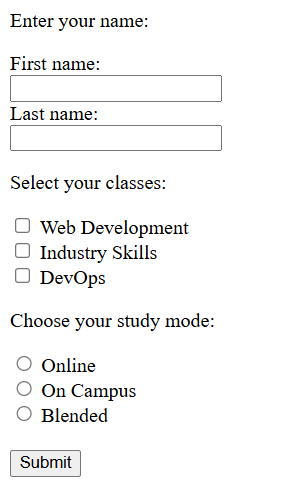

Building Forms into a Basic Webpage
===================================
Forms are a handy way of gathering data from individuals visiting your page. Forms are built with [HTML](https://www.w3schools.com/html/html_forms.asp) and styled with [CSS](https://www.w3schools.com/css/css_form.asp). Any time you visit a website for online shopping you are likely to use one or more of these methods to select what you would like to buy and in what colour/size/amount.

***Forms can include:***

- Single line text boxes
- Mulitple line text boxes
- Drop-down boxes
- Checkboxes
- Radio buttons
- Submit buttons 

***Examples:***



***Responsive Forms***

Responsive forms ensure that the form size changes as the users display changes. That is outside of the scope of this excercise, but once you know the basics it might be good to read up on.

***Excercise: Create Basic Forms on Webpage:***
1. Open the Ed challenge titled "HTML Element Form Challenge" and read the instructions.

2. Note that you are required to build:
    - An input field that takes first name
    - An input field that takes a last name
    - At least 2 additional form input fields that use different input types
    - A submit button

3. Format your HTML file with its usual requirements in the HTML / Head / Title / Body sections. Ensure that you have opening and closing tags for ```<form></form>```

4. Next add the following code in between the form tags.

------
First and Last Name Text Fields
------

```<form action="/action_page.php">  
    <p>Enter your name:</p>
    <label for="fname">First name:</label><br>
    <input type="text" id="fname" name="fname"><br>
    <label for="lname">Last name:</label><br>
    <input type="text" id="lname" name="lname">
```
 -----
 Checkboxes for Gender
 -----
```<p>Select your classes:</p>
    <input type="checkbox" id="unit1" name="unit1" value="web_dev">
    <label for="gender1"> Web Development</label><br>
    <input type="checkbox" id="unit2" name="unit2" value="ind_skills">
    <label for="unit2"> Industry Skills</label><br>
    <input type="checkbox" id="unit3" name="unit3" value="prof_skills">
    <label for="gender3"> DevOps</label>
```
-----
Radio Buttons for Study Mode
-----
 
```<p>Choose your study mode:</p>
    <input type="radio" id="online" name="study_mode" value="online">
    <label for="online">Online</label><br>
    <input type="radio" id="on_campus" name="study_mode" value="on_campus">
    <label for="on_campus">On Campus</label><br>
    <input type="radio" id="blended" name="study_mode" value="blended">
    <label for="blended">Blended</label>
```
-----
Submit Button
-----

```<input type="submit" value="Submit">```

>The End

>Happy Coding!
